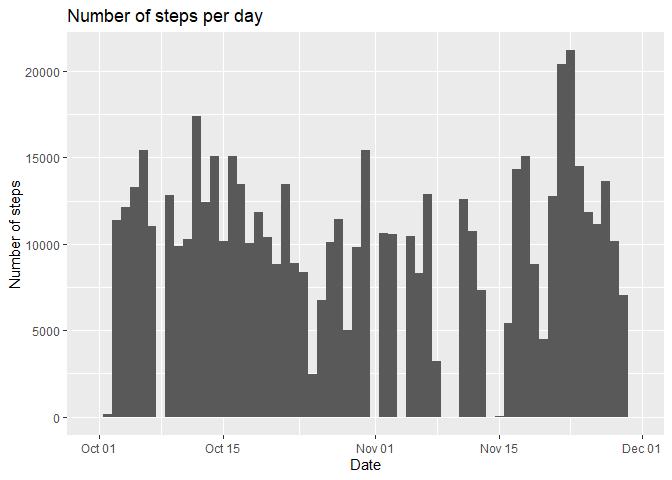
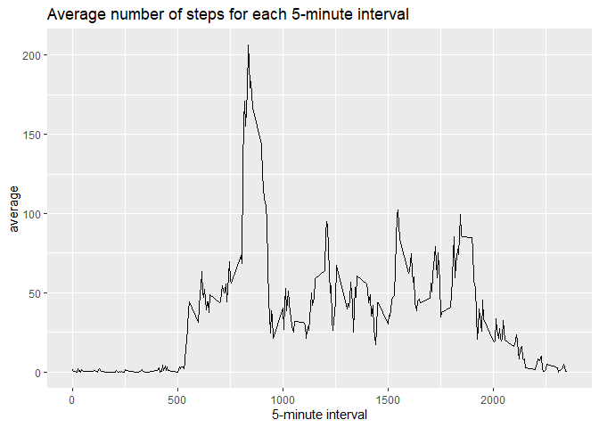
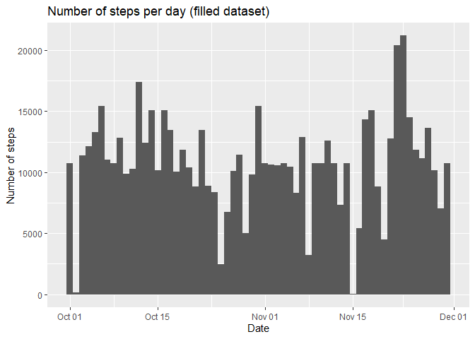
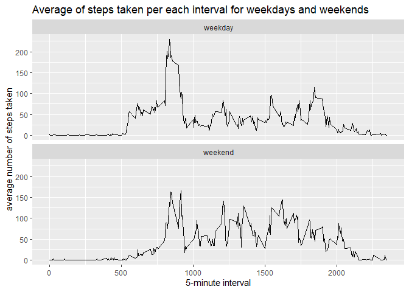

## Loading and preprocessing the data


```r
# this chunk doesn't print any outputs

library(tidyverse)

unzip("activity.zip")

activity_csv <- read_csv("./activity.csv")
```


## What is mean total number of steps taken per day?


```r
# calculate total number of steps for each day
steps_per_day <- activity_csv %>% group_by(date) %>% 
  summarise(steps = sum(steps))

# plotting histogram of the total number of steps taken each day
## number of bins set to 61 so there is one bin for each day - thats probably not the best way to do a histogram but this is how I understood the instructions :)
ggplot(activity_csv, aes(date)) +
  geom_histogram(aes(weight = steps), bins = 61) +
  labs(title = "Number of steps per day", x = "Date", y = "Number of steps")
```

<!-- -->

```r
# computing daily mean and median and storing them for later use
daily_mean <- mean(steps_per_day$steps, na.rm = TRUE)
daily_median <- median(steps_per_day$steps, na.rm = TRUE)
```


Average number of steps taken by the subject in one day is **1.0766189\times 10^{4} steps**. Daily median is **1.0765\times 10^{4} steps**.


## What is the average daily activity pattern?


```r
# computing average number of steps for each interval
interval_average <- activity_csv %>% group_by(interval) %>% 
  summarise(average = mean(steps, na.rm = TRUE))

# creating time series chart
ggplot(interval_average, aes(x = interval, y = average)) +
  geom_line() +
  labs(title = "Average number of steps for each 5-minute interval", x = "5-minute interval", "average steps taken")
```

<!-- -->


5-minute interval that contains most average number of steps taken is **the 835th interval**.


## Imputing missing values


```r
# count NAs and save the value for later use
num_of_nas <- sum(is.na(activity_csv$steps))


# create second dataset with the missing data filled in witth the average value for given 5-minute interval
## each missing value in steps is replaced with appropriate value from interval_average

activity_filled <- activity_csv


for (n in 1:nrow(activity_filled)) {
  if (is.na(activity_filled$steps[n])) {
    activity_filled$steps[n] <- unlist(interval_average[which(interval_average$interval %in% activity_filled$interval[n]), 2])
  } else {
    next
  }
}
```


There were 2304 NAs in the dataset. All NAs were replaced by average number of steps for given 5-minute interval.


```r
# make the histogram again
ggplot(activity_filled, aes(date)) +
  geom_histogram(aes(weight = steps), bins = 61) +
  labs(title = "Number of steps per day (filled dataset)", x = "Date", y = "Number of steps")
```

<!-- -->

```r
# count the total number of steps taken for each day (with missing values filled)
steps_per_day_filled <- activity_filled %>% group_by(date) %>% 
  summarise(steps = sum(steps))

# calculate mean and median and store them for later use
mean_filled <- mean(steps_per_day_filled$steps)
median_filled <- median(steps_per_day_filled$steps)
```


For the filled dataset, average number of steps taken by the subject in one day is **1.0766189\times 10^{4} steps**. Daily median is **1.0766189\times 10^{4} steps**. Theese values are very close to the original ones.


## Are there differences in activity patterns between weekdays and weekends?


```r
# create a new factor variable distinguishing between weekdays and weekends
activity_filled$weekday <- if_else(weekdays(activity_filled$date) == "Saturday" | weekdays(activity_filled$date) == "Sunday", "weekend", "weekday")

# compute average number of steps taken for each interval (separately for weekdays and weekends) and plot the difference between weekdays and weekends
activity_filled %>% group_by(weekday, interval) %>% 
  summarise(average = mean(steps)) %>% 
  ggplot(aes(x = interval, y = average)) +
  geom_line() +
  facet_wrap(~weekday, ncol = 1) +
  labs(title = "Average of steps taken per each interval for weekdays and weekends", x = "5-minute interval", y = "average number of steps taken")
```

<!-- -->

There seems to be some differences between weekdays and weekdays in average activity patterns.

